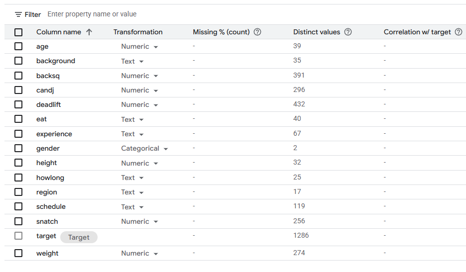
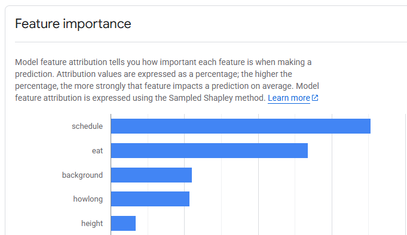

# AutoML using GCP Vertex AI (No Code)

## Dataset

## Data Insights

According to the GCP documentation, the text transformations are creating embeddings from the categories instead of doing
direct encoding like one-hot. This extracts much more valuable features from the original data and as seen below they 
are among the top important features.

## Pipeline DAG

## Top 5 Features

## Top Models

GCP uses transfer learning on pretrained DNNs for AutoML. It does not directly expose any explicit models used, nor are the
hyperparameters shown. 

Conceptually, smaller and shallower models will have faster inference (speed) 

## Models compared to previous models

The models produced by Vertex AI AutoMl achieve near 0 RMSE and MSE. This is definitely better performance than
my previous RF model which was around 60 RMSE and 5% MAPE.
